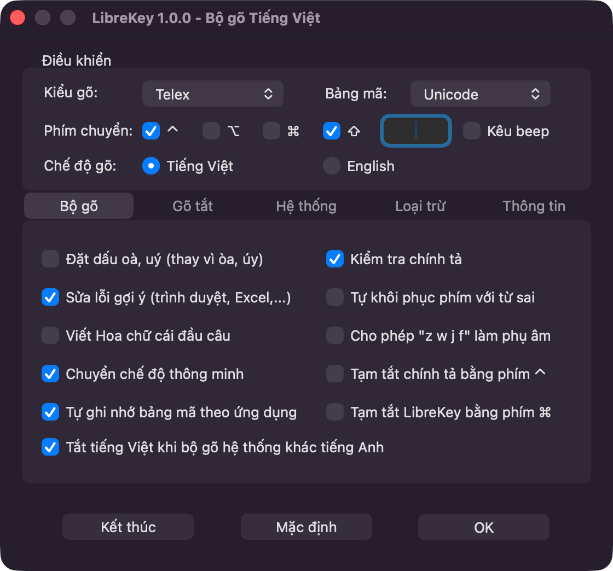
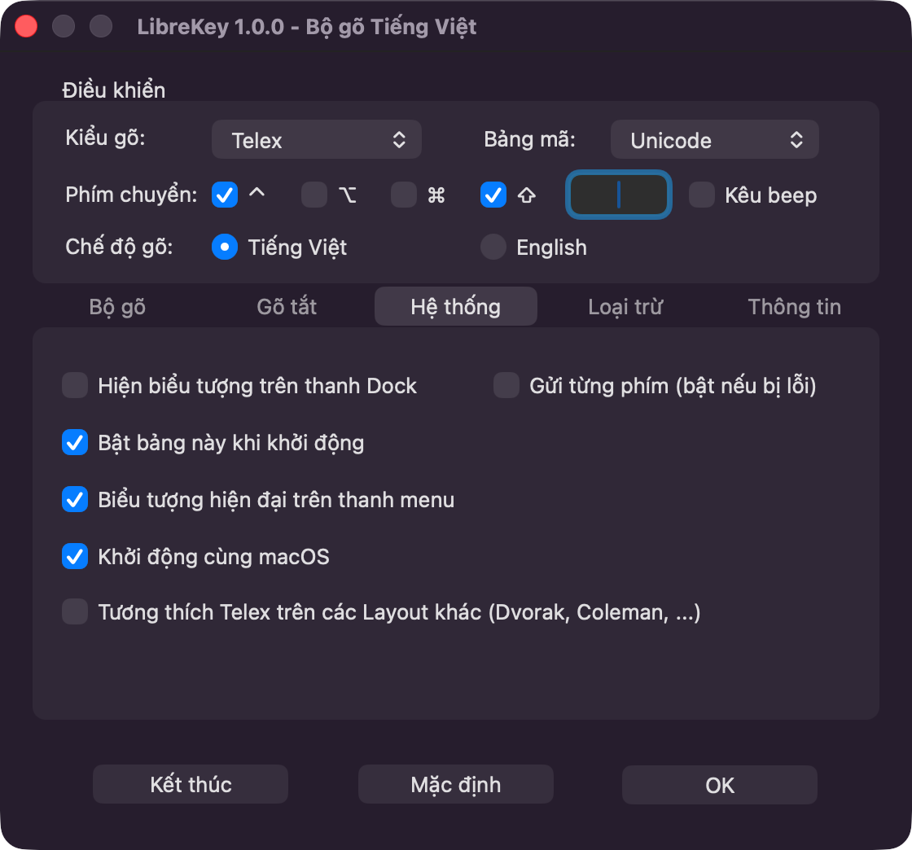
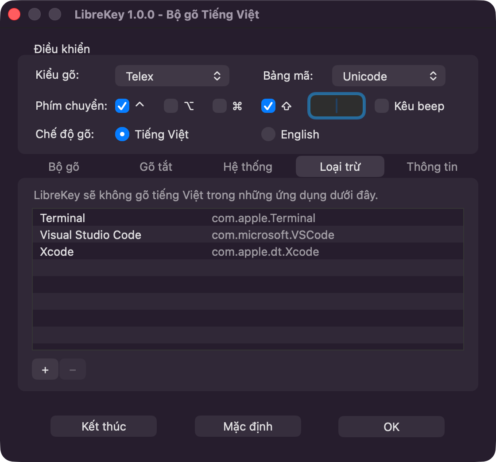
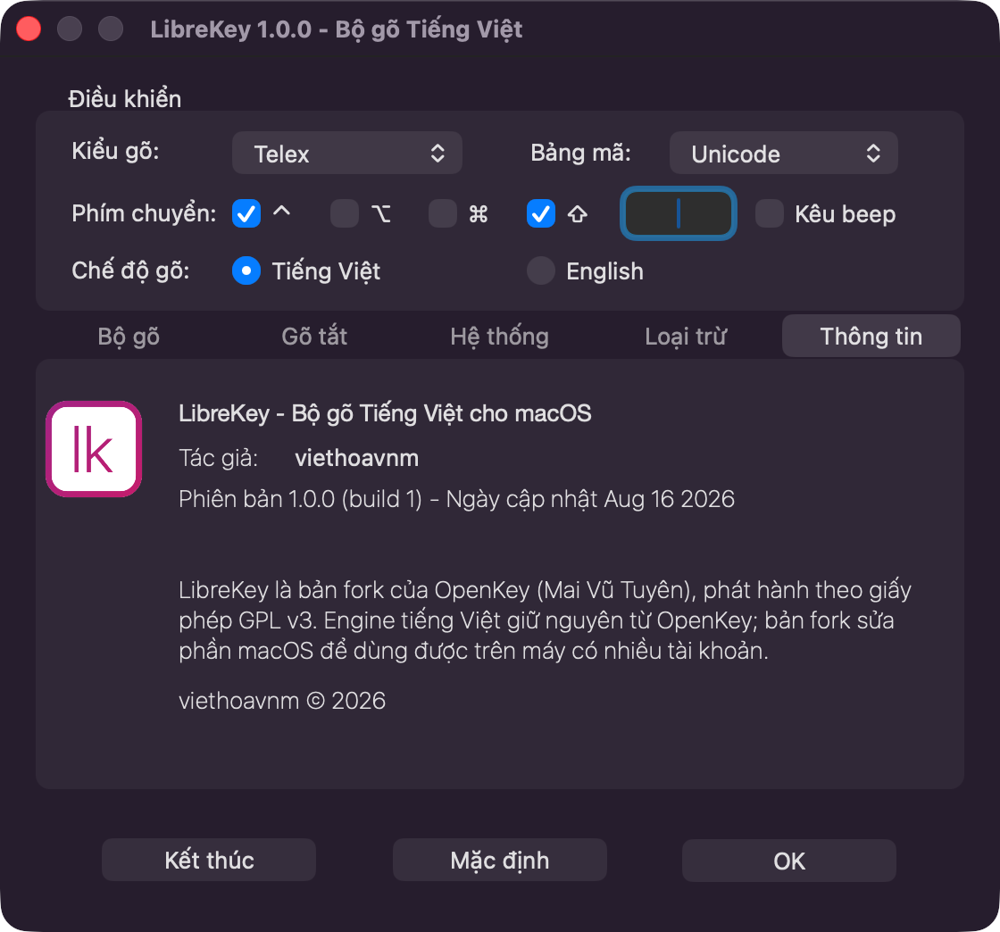

# LibreKey

[](https://github.com/viethoavnm/LibreKey/releases/latest)
[](https://github.com/viethoavnm/LibreKey/releases)
[](LICENSE)
[](#cài-đặt)

**[⬇ Tải bản mới nhất](https://github.com/viethoavnm/LibreKey/releases/latest)**

**Bộ gõ tiếng Việt cho macOS, chạy được trên máy có nhiều tài khoản người dùng.**

Phiên bản hiện tại: **1.0.0** · macOS 10.13 trở lên · Universal (Apple Silicon + Intel) · GPL v3



> ### ⚠️ Đây là bản fork của OpenKey
>
> LibreKey **không phải phần mềm viết mới**. Đây là tác phẩm phái sinh của
> **[OpenKey](https://github.com/tuyenvm/OpenKey)** — bộ gõ tiếng Việt nguồn mở
> do **Mai Vũ Tuyên** viết và phát hành theo giấy phép **GPL v3**.
>
> Gần như toàn bộ công sức thuộc về tác giả OpenKey. Fork này chỉ sửa một nhóm
> lỗi ở phần vỏ macOS để ứng dụng dùng được trên máy có nhiều tài khoản, và thêm
> vài tính năng nhỏ.

---

## Tải về

Vào [Releases](https://github.com/viethoavnm/LibreKey/releases/latest) tải file
`.zip` phiên bản mới nhất, giải nén rồi kéo `LibreKey.app` vào `/Applications`.

> ### ⚠️ Bản phát hành đang ký ad-hoc
>
> LibreKey chưa có chữ ký Developer ID và chưa được Apple công chứng
> (notarize) — việc đó cần tài khoản Apple Developer trả phí. Hệ quả: khi mở lần
> đầu, macOS sẽ báo **"LibreKey không thể mở được vì Apple không thể kiểm tra
> xem nó có chứa mã độc hay không"**.
>
> Cách mở:
>
> 1. Chuột phải vào `LibreKey.app` → **Open** → **Open** lần nữa ở hộp thoại. Hoặc
> 2. Vào *System Settings → Privacy & Security*, kéo xuống mục Security và bấm
>    **Open Anyway**.
>
> Nếu không muốn tin bản build sẵn, hãy [build từ mã nguồn](#build) — mất khoảng
> một phút và không cần tài khoản Apple nào.

## Cài đặt

1. Kéo `LibreKey.app` vào thư mục `/Applications`.
2. Vào *System Settings → Privacy & Security → Accessibility* và bật LibreKey.

**Trên máy nhiều người dùng:** quyền Accessibility do macOS quản lý ở cấp hệ
thống và cần tài khoản quản trị để mở khoá. Một tài khoản thường không tự cấp
quyền cho mình được — phải nhờ quản trị viên. Khi đã cấp cho
`/Applications/LibreKey.app` thì mọi tài khoản dùng chung bản cài đó đều nhận
được quyền.

Nếu bạn đang dùng bộ gõ khác (kể cả OpenKey gốc), hãy tắt hẳn nó. Hai bộ gõ cùng
chạy sẽ tranh nhau sửa phím và làm hỏng chữ.

## Ảnh màn hình

| Hệ thống | Loại trừ ứng dụng |
|---|---|
|  |  |

| Thông tin |
|---|
|  |

---

## Vì sao có fork này

Trên máy macOS có nhiều tài khoản, OpenKey chỉ chạy được cho **một người dùng duy
nhất trên toàn máy**. Ai đăng nhập trước thì được, người còn lại hoàn toàn không
mở được ứng dụng — và không có thông báo lỗi nào.

Nguyên nhân đã được xác định và đo trực tiếp: `Info.plist` của OpenKey đặt
`LSMultipleInstancesProhibited = true`. LaunchServices nhìn xuyên qua các phiên
đăng nhập, nên khi user A đang chạy OpenKey thì user B xin mở sẽ nhận
`-10829 kLSMultipleSessionsNotSupportedErr`.

Kết quả đo A/B trên cùng một máy, cùng thời điểm, cùng hai tài khoản đang đăng nhập:

| Bản | `LSMultipleInstancesProhibited` | Khi tài khoản khác đang giữ ứng dụng |
|---|---|---|
| OpenKey 2.0.5 | `true` | ❌ `-10829`, bị chặn hoàn toàn |
| LibreKey 1.0.0 | `false` | ✅ chạy song song bình thường |

## Fork này lấy gì và sửa gì

| Thành phần | Nguồn gốc |
|---|---|
| `Sources/OpenKey/engine/` — toàn bộ engine tiếng Việt: bỏ dấu, kiểm tra chính tả, bảng mã, gõ tắt, chuyển mã | **Của OpenKey, giữ nguyên không sửa một dòng** |
| `Sources/OpenKey/win32/`, `Sources/OpenKey/linux/` | **Của OpenKey**, fork này không đụng tới |
| Giao diện macOS, storyboard, luồng khởi động | Của OpenKey, đã sửa phần đa người dùng và thêm tab Loại trừ |
| Vòng đời ứng dụng, event tap, login item, khoá một-instance | Sửa và viết thêm trong fork này |
| Danh sách loại trừ ứng dụng | Của fork này |
| Tên, logo, bundle identifier, số phiên bản | Của fork này |

Nói cách khác: **phần khó là của OpenKey, fork này chỉ sửa phần vỏ.** Nếu LibreKey
gõ tiếng Việt tốt, đó là nhờ engine của Mai Vũ Tuyên. Ghi công cũng hiện ngay
trong ứng dụng ở tab *Thông tin*, chứ không chỉ nằm trong README này.

## Những gì đã sửa so với OpenKey

### Đa người dùng

| # | Vấn đề | Cách xử lý |
|---|---|---|
| 1 | Cổng một-instance của LaunchServices chặn toàn máy | `LSMultipleInstancesProhibited = false`, thay bằng khoá `flock()` đặt trong thư mục Application Support của từng người dùng — phân tách theo người dùng theo đúng bản chất, và không có tranh chấp check-then-act |
| 2 | Target login item bị mất khỏi project | Khôi phục target `LibreKeyHelper` và nhúng lại vào `Contents/Library/LoginItems`. Trước đó `SMLoginItemSetEnabled` luôn thất bại âm thầm nên "chạy cùng hệ thống" không hề hoạt động với bất kỳ ai build từ mã nguồn |
| 3 | Helper kích hoạt nhầm instance của người dùng khác | Dùng `openApplicationAtURL:` với `createsNewApplicationInstance = YES` |
| 4 | Event tap chết vĩnh viễn sau khi chuyển tài khoản | Xử lý `kCGEventTapDisabledBy*` trong callback, lắng nghe `NSWorkspaceSessionDidResignActive` / `DidBecomeActive` |

### Lỗi khác

| # | Vấn đề | Cách xử lý |
|---|---|---|
| 5 | Thoát hẳn khi chưa được cấp quyền Accessibility | Ở lại chạy, tự dò quyền mỗi giây và khởi động tiếp khi được cấp. Không cần mở lại ứng dụng |
| 6 | Hộp thoại xin quyền có thể nằm khuất phía sau | Kích hoạt ứng dụng trước khi hiện; thêm mục "Cấp quyền cho LibreKey..." trên menu bar |
| 7 | Rò tài nguyên mỗi lần khởi tạo lại event tap | Tách phần cấp phát một lần khỏi phần đọc cấu hình |
| 8 | Hộp thoại cập nhật làm sập ứng dụng | `OpenKeyUpdate.app` không hề được build, khiến `[NSURL fileURLWithPath:nil]` ném ngoại lệ. Đã chặn và tắt hẳn kênh cập nhật |
| 9 | Release build không link được trên Xcode mới | Nâng deployment target từ 10.10 lên 10.13 (`libarclite` đã bị Apple gỡ bỏ) |
| 10 | Project không build được nếu chưa gán development team | Chuyển sang ký ad-hoc thủ công, khớp với thiết lập cấp project vốn đã khai `CODE_SIGN_IDENTITY = "-"` |

### Sửa lỗi đúp từ trên trình duyệt Chromium

| # | Vấn đề | Cách xử lý |
|---|---|---|
| 11 | Cách sửa chỉ nhận đúng Chrome, Brave và Edge | Dò theo tiền tố bundle id trên danh sách riêng, nên Chromium, Chrome Beta/Dev/Canary, Vivaldi, Opera, Cốc Cốc và Arc đều được nhận. Trước đây so khớp tuyệt đối trên một danh sách vốn dùng cho việc khác |
| 12 | Tính năng gắn nhãn beta và mặc định tắt | Bỏ hẳn ô tích, cho chạy thẳng. Chỉ đổi giá trị mặc định là không đủ: `OpenKeyReloadSettings` ghi đè biến từ `NSUserDefaults` mỗi lần khởi tạo, còn `loadDefaultConfig` chỉ chạy đúng lần đầu, nên người đã dùng sẽ mãi ở trạng thái tắt mà không còn ô tích để bật |
| 13 | Lệch `_syncKey` khi gõ VNI / Unicode tổ hợp trên Chromium | Vòng lặp backspace đếm thừa một đơn vị so với số ký tự thực sự bị xoá; với `backspaceCount` từ 2 trở lên còn đọc `back()` trên vector rỗng |

Chi tiết từng thay đổi nằm trong [CHANGELOG.md](CHANGELOG.md) và lịch sử commit.

## Tính năng riêng của LibreKey

### Loại trừ ứng dụng

Tab **Loại trừ** liệt kê những ứng dụng bạn không muốn gõ tiếng Việt trong đó —
terminal, trình soạn code, máy ảo, game. Bấm **+** để chọn ứng dụng (chọn được
nhiều cùng lúc), bấm **−** để bỏ dòng đang chọn.

Trong ứng dụng bị loại trừ, phím **đi thẳng qua, engine không đụng vào** — không
phải kiểu ép sang chế độ English. Riêng phím tắt chuyển ngôn ngữ và chuyển mã
vẫn dùng được vì đó là phím tắt toàn cục.

Danh sách lưu theo từng tài khoản macOS, khớp với bản chất đa người dùng của fork
này.

## Tính năng kế thừa từ OpenKey

**Kiểu gõ:** Telex, VNI, Simple Telex

**Bảng mã:** Unicode dựng sẵn, TCVN3 (ABC), VNI Windows, Unicode tổ hợp,
Vietnamese Locale CP 1258

**Tuỳ chọn:**
- Đặt dấu kiểu mới — oà, uý thay vì òa, úy
- Gõ nhanh — cc=ch, gg=gi, kk=kh, nn=ng, qq=qu, pp=ph, tt=th
- Kiểm tra chính tả và ngữ pháp
- Phục hồi phím với từ sai
- Chạy cùng hệ thống
- Biểu tượng xám trên thanh menu, hợp với Dark mode
- Đổi chế độ gõ bằng phím tắt tuỳ chọn
- Sửa lỗi autocorrect trên Chrome, Safari, Firefox, Microsoft Excel
- Sửa lỗi gạch chân của bộ gõ mặc định macOS
- Tạm tắt kiểm tra chính tả bằng Ctrl; tạm tắt bộ gõ bằng Cmd/Alt
- Cho phép f z w j làm phụ âm đầu
- Gõ tắt phụ âm đầu (f→ph, j→gi, w→qu) và phụ âm cuối (g→ng, h→nh, k→ch)
- Hiện biểu tượng trên Dock
- Viết hoa chữ cái đầu câu
- Chế độ gửi từng phím, cho ứng dụng không tương thích với cách gửi một lần
- **Gõ tắt (Macro)** — không giới hạn số ký tự, khác với giới hạn 20 ký tự của macOS
- **Chuyển chế độ thông minh** — tự nhớ ứng dụng nào dùng tiếng Việt, ứng dụng nào dùng tiếng Anh
- **Tự nhớ bảng mã theo ứng dụng** — tiện cho Photoshop, CAD với VNI/TCVN3
- **Công cụ chuyển mã** — chuyển văn bản cũ VNI, TCVN3 sang Unicode, có phím tắt

---

## Trạng thái kiểm thử

Nói thẳng để bạn biết chỗ nào chắc chắn, chỗ nào chưa.

**Đã kiểm chứng**
- Chạy song song khi tài khoản khác đang giữ ứng dụng (đo A/B như bảng trên), và
  quan sát được hai tài khoản cùng chạy LibreKey đồng thời trên một máy
- Đăng ký login item qua `SMAppService` — chạy được **kể cả với bản ký ad-hoc**
- Không tự thoát khi thiếu quyền Accessibility — chạy thật
- Helper được nhúng đúng vị trí trong bundle
- Tab Loại trừ: thêm ứng dụng, ghi xuống `NSUserDefaults`, hiện đúng trong bảng
- **38 unit test** (`LibreKeyTests`) — kho gốc không có test nào

**Chưa kiểm chứng** — cần một bản có chữ ký hợp lệ và một máy có hai tài khoản
- Event tap phục hồi sau khi Fast User Switching
- Gõ tiếng Việt trên chính bản LibreKey
- Cổng chặn phím trong ứng dụng bị loại trừ (logic quyết định đã có test, nhưng
  phần nối vào event tap thì chưa chạy thật)

## Phát hành

| | |
|---|---|
| Phiên bản | **1.0.0** (build 1) |
| Ngày phát hành | 16/08/2026 |
| Yêu cầu | macOS 10.13 (High Sierra) trở lên |
| Kiến trúc | Universal — `arm64` (Apple Silicon) + `x86_64` (Intel) |
| Bundle ID | `vn.viethoavnm.librekey` |
| Giấy phép | GPL v3 |
| Bản build sẵn | [Releases](https://github.com/viethoavnm/LibreKey/releases/latest) — ký ad-hoc, xem lưu ý ở phần [Tải về](#tải-về) |

Dòng *Ngày cập nhật* ở tab Thông tin lấy từ `__DATE__`, tức là **ngày biên dịch**
của chính bản build đó, không phải ngày phát hành ghi ở bảng trên.

Nhật ký thay đổi đầy đủ: [CHANGELOG.md](CHANGELOG.md).

---

## Build

Yêu cầu: **Xcode 15 trở lên** (đã kiểm tra với Xcode 26.3). Không cần tài khoản
Apple Developer — project ký ad-hoc sẵn.

```bash
cd Sources/OpenKey/macOS

# build bản Release
xcodebuild -project OpenKey.xcodeproj -scheme LibreKey -configuration Release build

# chạy toàn bộ 38 unit test
xcodebuild -project OpenKey.xcodeproj -scheme LibreKey test
```

Kết quả nằm trong DerivedData, đường dẫn lấy bằng:

```bash
xcodebuild -project OpenKey.xcodeproj -scheme LibreKey -configuration Release \
    -showBuildSettings | grep " BUILT_PRODUCTS_DIR"
```

Muốn kết quả ra thư mục cạnh mã nguồn thì thêm `-derivedDataPath build`, khi đó
app nằm ở `build/Build/Products/Release/LibreKey.app`, đã nhúng sẵn
`LibreKeyHelper.app` trong `Contents/Library/LoginItems`.

### Kiểm tra bản build

```bash
APP=build/Build/Products/Release/LibreKey.app

lipo -archs "$APP/Contents/MacOS/LibreKey"          # mong đợi: x86_64 arm64
ls "$APP/Contents/Library/LoginItems"               # mong đợi: LibreKeyHelper.app
codesign --verify --deep --strict "$APP"            # không in gì là hợp lệ
```

Thiếu `LibreKeyHelper.app` nghĩa là login item chưa được nhúng, và tính năng chạy
cùng hệ thống sẽ hỏng âm thầm — đây đúng là lỗi mà fork này sinh ra để sửa, nên
đáng kiểm tra mỗi lần đóng gói.

### Vì sao nên ký bằng chữ ký thật

Bản ký ad-hoc build được và chạy được — login item vẫn đăng ký bình thường, đã
kiểm chứng. Hai hạn chế thật sự:

1. macOS gắn quyền Accessibility theo **chữ ký**, nên mỗi lần build lại là chữ ký
   đổi và bạn phải cấp quyền lại từ đầu.
2. Bản ad-hoc không mang sang máy khác được vì Gatekeeper sẽ chặn.

Thêm Apple ID vào Xcode → *Settings → Accounts* là đủ để có Personal Team miễn
phí, đủ dùng trên máy của chính bạn. Muốn phát hành cho người khác thì cần
Developer ID và notarization.

### Đóng gói bản phát hành bằng Xcode

1. Mở `Sources/OpenKey/macOS/OpenKey.xcodeproj`.
2. Ở tab *Signing & Capabilities*, chọn team của bạn cho **cả ba target**:
   `LibreKey`, `LibreKeyHelper`, `LibreKeyTests`.
3. Chọn scheme **LibreKey**, rồi vào menu *Product → Archive*.
4. Trong cửa sổ Organizer hiện ra, bấm *Distribute App* và chọn nơi lưu.

## Logo

Logo được **sinh bằng mã nguồn** thay vì lưu ảnh nhị phân, nên có thể tái tạo ở
mọi kích thước và thiết kế nằm ở nơi đọc và sửa được:

```bash
cd Sources/OpenKey/macOS
swiftc -O Tools/GenerateIcons.swift -o /tmp/genicons
/tmp/genicons ModernKey/Resources
iconutil -c icns ModernKey/Resources/Icon.iconset -o ModernKey/Resources/Icon.icns
rm -rf ModernKey/Resources/Icon.iconset
```

## Chưa hoàn thiện

- Bản phát hành mới chỉ ký ad-hoc, chưa notarize, nên macOS chặn ở lần mở đầu
  tiên và người dùng phải bấm Open Anyway. Cần tài khoản Apple Developer trả phí
  mới xử lý dứt điểm được.
- Không có kênh cập nhật tự động, và toàn bộ mã liên quan đã được gỡ bỏ. Cố ý
  như vậy: nếu trỏ về manifest của OpenKey thì LibreKey 1.0.0 sẽ thấy OpenKey
  2.0.3 là "bản mới" và rủ người dùng thay ứng dụng bằng một sản phẩm khác.
- Bảng trong tab Loại trừ không có tiêu đề cột. Storyboard dùng toạ độ tuyệt đối
  chứ không có Auto Layout, và cách thêm `tableHeaderView` bằng tay vào XML không
  ăn — cần mở Xcode kéo thả.
- Nút OK trong Bảng điều khiển đã được đặt làm nút mặc định (phím Return), nhưng
  chưa hiển thị màu nhấn như nút mặc định chuẩn. Chưa tìm ra nguyên nhân.
- Mã nguồn Windows và Linux trong repo là của OpenKey gốc, fork này không đụng tới.
  Bản Windows vẫn còn ô tích "Sửa lỗi trên Chromium" mặc định tắt và vẫn so khớp
  tên `.exe` tuyệt đối — cùng loại lỗi đã sửa ở bản macOS.
- Tên file và tên lớp bên trong (`OpenKeyManager`, `OpenKey.mm`, thư mục
  `ModernKey/`) vẫn giữ tên cũ. Đây chỉ là vấn đề nội bộ, người dùng không thấy.

## Giấy phép và ghi công

Phát hành theo **GNU General Public License v3** — xem [LICENSE](LICENSE).

### Tác phẩm gốc

**OpenKey** — Bộ gõ tiếng Việt nguồn mở cho macOS, Windows và Linux.

- Tác giả: **Mai Vũ Tuyên** (<maivutuyen.91@gmail.com>)
- Mã nguồn: [github.com/tuyenvm/OpenKey](https://github.com/tuyenvm/OpenKey)
- Trang chủ: [open-key.org](http://open-key.org)
- Fanpage: [facebook.com/OpenKeyVN](https://www.facebook.com/OpenKeyVN)
- Giấy phép: GPL v3

LibreKey giữ nguyên giấy phép GPL v3 của OpenKey.

### Nghĩa vụ của bạn nếu phân phối lại

GPL v3 là giấy phép copyleft. Nếu bạn phát hành lại LibreKey, hoặc phát hành bản
bạn sửa thêm từ LibreKey, thì bản đó:

1. **phải là mã nguồn mở**, kèm theo mã nguồn đầy đủ;
2. **phải tiếp tục dùng giấy phép GPL v3**;
3. **phải ghi rõ tác phẩm gốc là OpenKey của Mai Vũ Tuyên**;
4. phải nêu rõ bạn đã thay đổi những gì.

Đây là yêu cầu pháp lý của GPL v3, đồng thời cũng đúng mong muốn mà tác giả
OpenKey ghi trong README gốc.

### Lời cảm ơn

Cảm ơn Mai Vũ Tuyên đã viết và mở mã nguồn OpenKey. Toàn bộ phần khó — engine
tiếng Việt, xử lý bàn phím, các bảng mã — là công của tác giả. Nếu LibreKey có
ích cho bạn, xin hãy ủng hộ tác giả gốc tại
[tuyenvm.github.io/donate.html](https://tuyenvm.github.io/donate.html).
